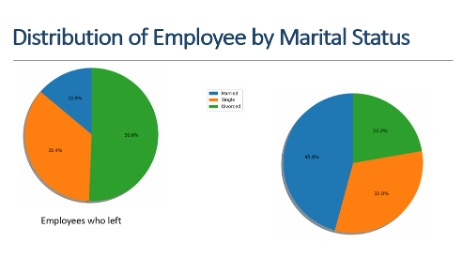
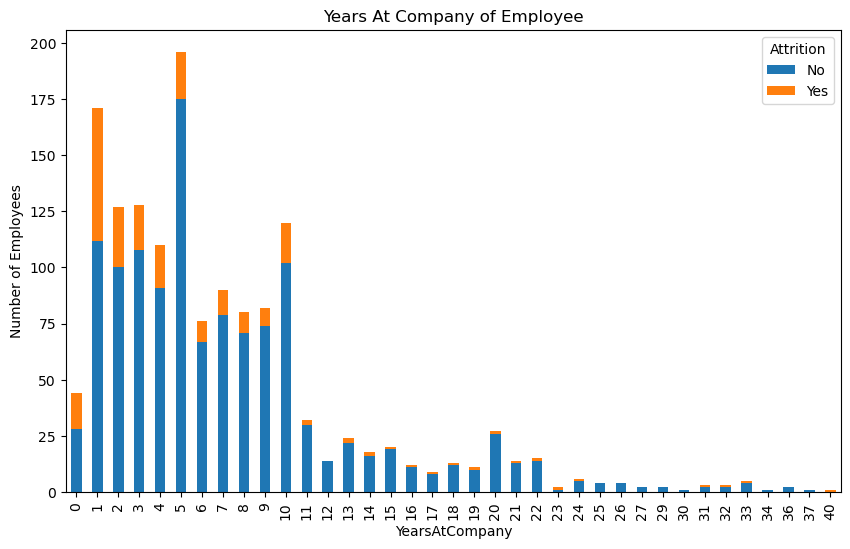
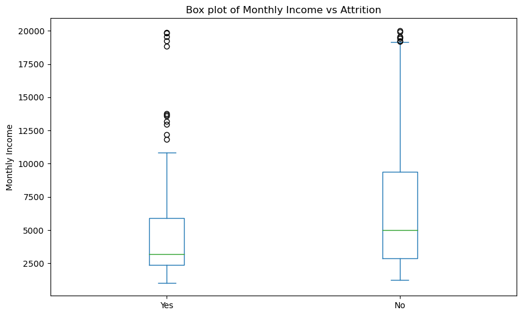
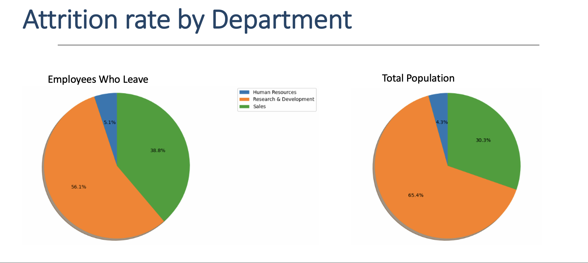
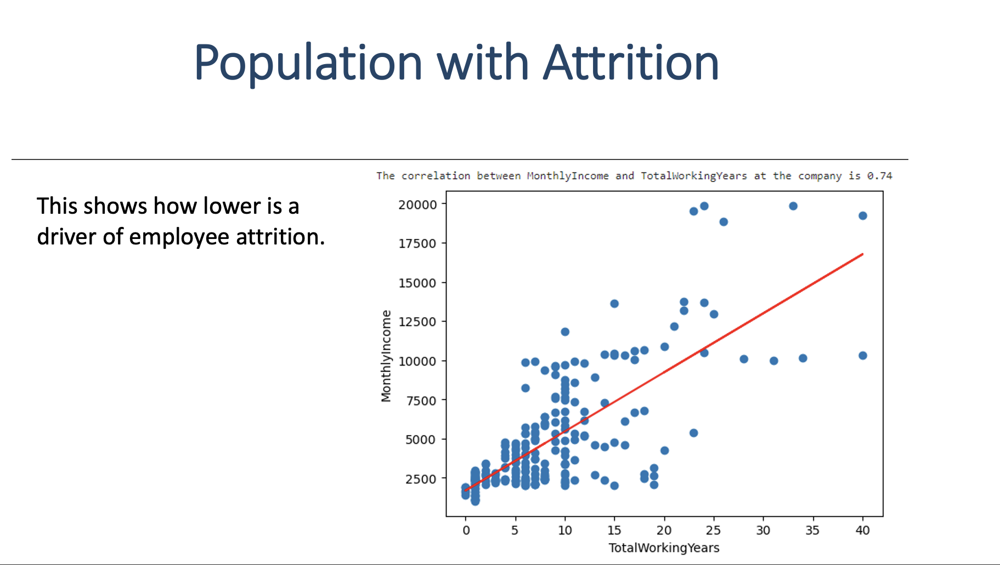
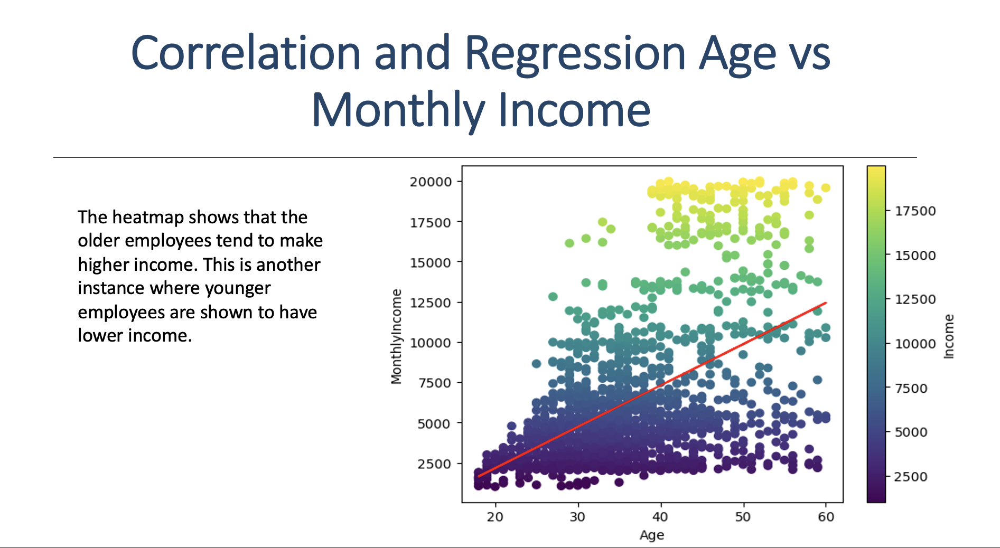
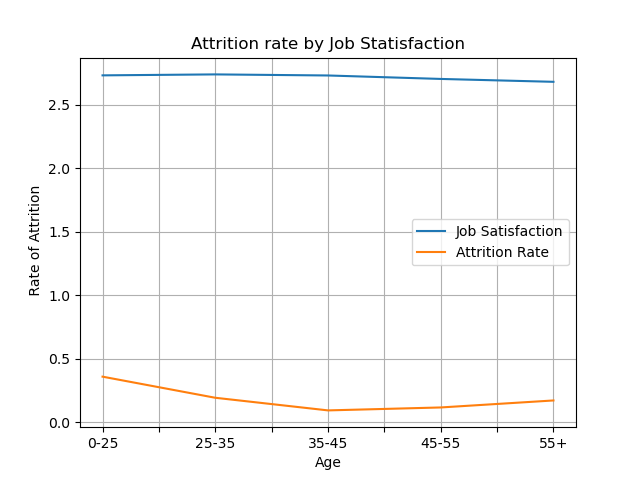

# Project1
# HR-Employee-Attrition-Analytics:

Employee Attrition Analytics (EAA) is the process of analyzing data to determine the causes of employee turnover in an organization. EAA allows organizations to identify potential risk areas or areas for improvement, such as high turnover rates in specific departments or job roles. 

By addressing these issues, businesses can improve employee morale, lower turnover costs, and ultimately build a more successful and sustainable business. 
Why these matters: Understanding what kinds of employees leave the company helps to retain talent and prevent burnout. This saves the costs of training new hires and invests in building long-term expertise in the company.

The group was interested in understanding how income, promotions, and potential burnout, could impact employee attrition.

Data Sourse from kaggle:
[This is a link to a  Data_set from kaggle](https://www.kaggle.com/datasets/rishikeshkonapure/hr-analytics-prediction?)

#   Group Development Process

•	Read data sources for HR Employee Attrition Analytics via Kaggle
•	Creation of data frames 
•	Creation of charts (pie charts, bar charts, scatter plots, line graphs, box plots)
•	Statistical analysis (correlation, linear regression)

# Conclusion: 

•	Most of the people leaving the company are young, single and in the beginning of their careers.  
•	Research & Development – the department that suffers disproportionately more attrition.
•	People that are lower on the pay scale are more likely to leave.

## Data Visuals used to determine conclusion:

#  Distribution of Employee Attrition in the Company

   

According the Pie Chart, we can say that out of 1470 employees, 16,1% of the employees left their job with some reasons while other 83.9% of the employees preferred to stay 

# Distribution of Employee by Marital Status

 

Single employees have the highest rate of attrition in the Marital Status category (left). At the end of the spectrum, a divorced employee will most likely stay at a job. The pie chart also points out, the Married employee will also likely engage in attrition more than a divorced employee but less frequently than the Single employee. From the above pie chart on the left, we can see the attrition rate based on Marital status of employees from highest to lowest as Singles, Married and then Divorced employees. 

 # Total of Years At Company of Employee
   
    
   The Total of Years at the company bar chart visualizes when employees are highly likely to leave their present company. The data shows after 10 years of tenure an employee will stay at their present employer but more importantly, employees leave at a higher rate when tenure is below 11 years. 

 # Attrition rate and mobthly income by department
   

  

  The paired visuals tie together monthly income and attrition by department. The department with the MOST attrition of employees is in Research and Development and the box plot points to low income as the reason. 

   
   
   This regression plot shows the low income is a main driver of attrition. 

   #    

   # Attrition rate by Job Satisfaction
   
This graph of Attrition by Job Satisfaction mainly visualizes that the employee attrition rate stabilizes between ages 35 to 45. It also depicts employees’ who are 0 through 45 years old tend to answer job .  The line for this age group lingers around 2.73 to 2.74 . Its not till age 45 and over does job satisfaction rate show a lower trend.
   

