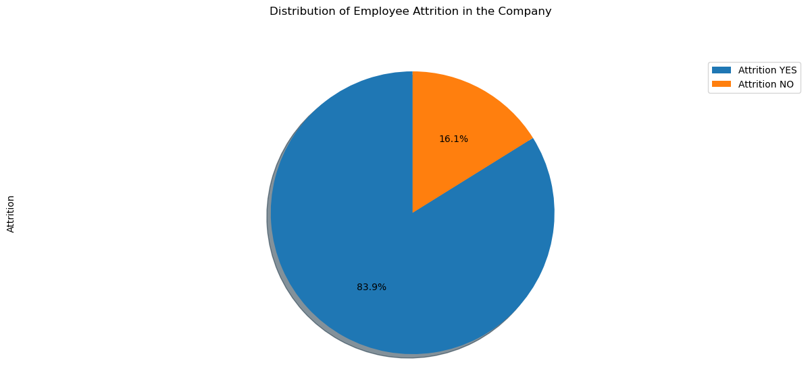

# Project1

# HR-Employee-Attrition-Analytics:

Attrition, in Human Resource terminology, refers to the phenomenon of the employees leaving the company. Attrition in a company is usually measured with a metric called attrition rate, which simply measures the no of employees moving out of the company (voluntary resigning or laid off by the company). Attrition Rate is also referred as churn rate or turnover.

Questions we must answer: 
1. What factors drive employee attrition?
2. What makes employees stay or  leave?
3. Is commute contributing to attrition the most?

Data_set from kaggle:
https://www.kaggle.com/datasets/rishikeshkonapure/hr-analytics-prediction?
datasetId=2480666&sortBy=dateRun&tab=bookmarked

# After analyzing this data, we came to the folloing conclusions: 

1. Distribution of Employee Attrition in the Company

   

 According the Pie Chart, we can say that out of 1470 employees, 16,1% of the employees left their job with some reasons while other 83.9% of the employees preferred to stay 

2. How Business Travel effects Attrition

    

 We can say from the data above that Employees who travel rarely have more attrition rate followed by Employees who travel frequently.
To reduce this attrition is to assign more travel ...

3. How monthly income effects Attrition

     

                                    Employees who left their jobs tend to have low average monthly income than those who stayed

    

 

