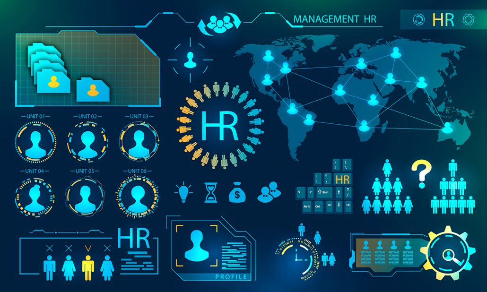

hi , guys ! If there is something to add , then  go head ...
# Project1
# HR-Employee-Attrition-Analytics:

Attrition, in Human Resource terminology, refers to the phenomenon of the employees leaving the company. Attrition in a company is usually measured with a metric called attrition rate, which simply measures the no of employees moving out of the company (voluntary resigning or laid off by the company). Attrition Rate is also referred as churn rate or turnover.

   Questions we must answer: 
1. What factors drive employee attrition?
2. What makes employees stay or  leave?
3. Is commute contributing to attrition the most?

Data_set from kaggle:
[This is a link to a  Data_set from kaggle](https://www.kaggle.com/datasets/rishikeshkonapure/hr-analytics-prediction?)

#   After analyzing this data, we came to the following conclusions: 

#  Distribution of Employee Attrition in the Company

   

According the Pie Chart, we can say that out of 1470 employees, 16,1% of the employees left their job with some reasons while other 83.9% of the employees preferred to stay 

 # How Business Travel effects Attrition
   

We can say from the data above that Employees who travel rarely have more attrition rate followed by Employees who travel frequently. To reduce this attrition is to assign more travel ...

 
 # How monthly income effects Attrition
   
Employees who left their jobs tend to have low average monthly income than those who stayed

 # Total of Years At Company of Employee
   
    
    According to this bar chart it is clear that most of newly employees quit ther jobs without having time to start (between 1 to 5 years ) . 
    Need to pay attention to the new people who just got the job.    

 # The correlation between age and monthly income
   

   The correlation between age and monthly income is 0.5. it tells us that there are weak liner realationship through a firm linear rule.
   
 # The correlation between years in current role and years since last promotion
   
   
   The correlation between years in current role and years since last promotion is 0.55. Weak.

 

